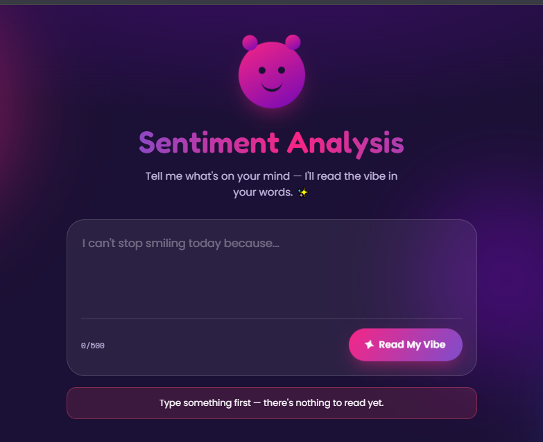
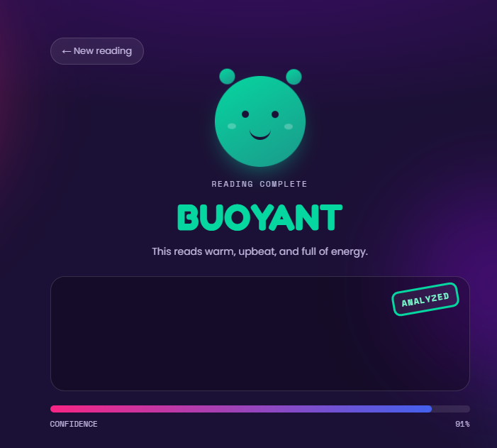
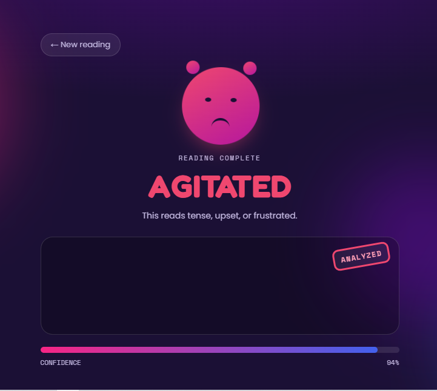
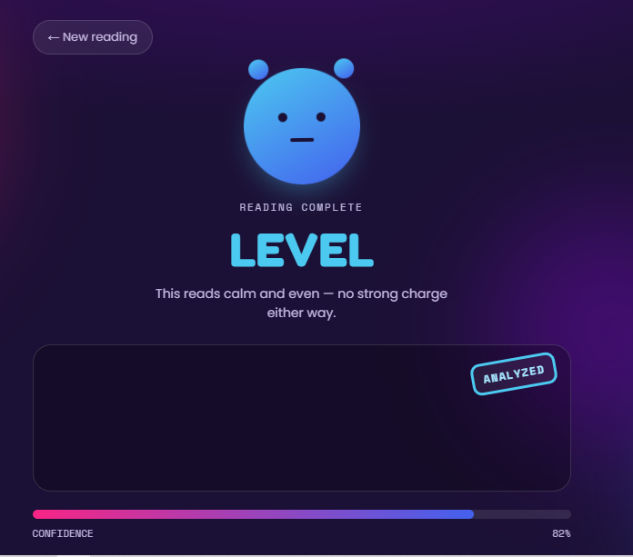

# Sentiment Analysis Web Application

An end-to-end AI application that classifies text as Positive, Negative, or Neutral using a Machine Learning model trained from scratch.

 Overview
This project was built as part of an internship, covering the full ML pipeline — from data cleaning to a trained model, a FastAPI backend, and an interactive frontend.

Tech Stack
- **Model:** TF-IDF Vectorization + Logistic Regression
- **Backend:** FastAPI (Python)
- **Frontend:** HTML, CSS, JavaScript
- **Dataset:** Twitter Sentiment Analysis Dataset (Kaggle)

 Project Structure
Sentiment-Analysis/
├── backend/
│   ├── main.py
│   ├── model.pkl
│   ├── vectorizer.pkl
│   └── requirements.txt
├── frontend/
│   ├── index.html
│   ├── style.css
│   └── script.js
├── training/
│   └── train_model.ipynb
└── README.md

 How to Run Locally

Backend
  bash
cd backend
pip install -r requirements.txt
uvicorn main:app --reload

Backend runs at `http://127.0.0.1:8000`

 Frontend
Open `frontend/index.html` with VS Code's Live Server extension.

 Model Performance
- Accuracy: 84.52%
- Precision (weighted): 85.02%
- Recall (weighted): 84.52%
- F1 Score (weighted): 84.50%

Features
- Real-time sentiment prediction with confidence score
- Animated, interactive UI with a mascot that reflects the predicted sentiment
- Clean REST API built with FastAPI

 Author
 Uswa 

 Screenshots

 empty Input validation 

 Positive Sentiment Result

Negative Sentiment Result

Neutral Sentiment Result
